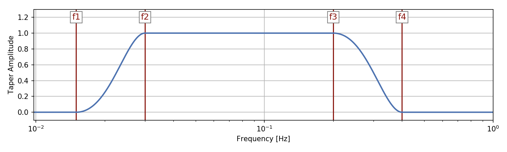

Processing
----------

The inversion workflow parameters for the processing of both observed and
synthetic data can be found in the ``params`` directory under
``ProcessObserved`` and ``ProcessSynthetic``, respectively. The main
difference between the two is the removal of the instrument response for the
observed traces. The rest of the processing steps are the same.

Cutting of the traces
+++++++++++++++++++++

First the traces are cut into equal length. The starttime is the the CMT
origin time and the end time is 7200 seconds later. It is important to
download and create synthetic traces that are longer than the cutting
parameters. Meaning, that the traces should start earlier than the start cut
time and later than the end cut time.

Detrend, demean, and first tapering
+++++++++++++++++++++++++++++++++++

Following the cutting, the traces are first detrended, which fixes a possible
"ramping" trend in the recording.

The next step on the agenda is demeaning.
Seismic recordings are prone to have a slightly higher or lower mean. This
can effect many of the following processes. A standard seismology example would
be the estimation of the earthquake's magnitude. If the the mean is higher
everywhere then the power spectrum, which is often used for magnitude
estimation, will also contain higher values. This leads to incorrect - here,
too high - computations of the earthquake magnitude.

The last step in this section is the the first simple taper that is applied
to the ends of the traces before filtering to avoid ringing at the ends of
the traces after filtering. Here, a Hann window and a percentage of 0.05,
following the standard SAC routine. This means 5% of the total number of
points is are tapered on each side of the trace. That is, if the trace has
100 samples, on each side of the trace 5 points are tapered.

Instrument response removal
+++++++++++++++++++++++++++

Now if the response flag is is set to ``True``, as for observed data in this
case, the data are filtered ones before the response removal. This is done
using a SAC style filter.

The corner are set in the parameter file using the ``pre_filt`` parameter. In
the current processing setup this frequency corners are set to [0.0075, 0
.0100, 0.0250, 0.0313] Hz.

Filtering
+++++++++

Both observed and synthetic traces are filtered with band-pass filters.